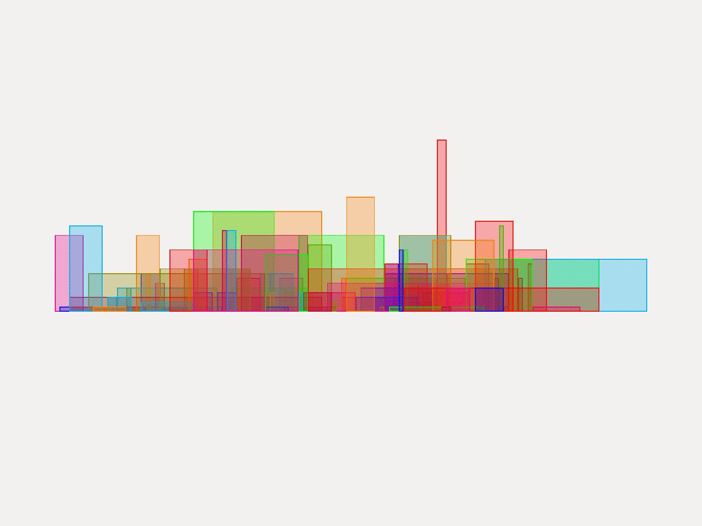
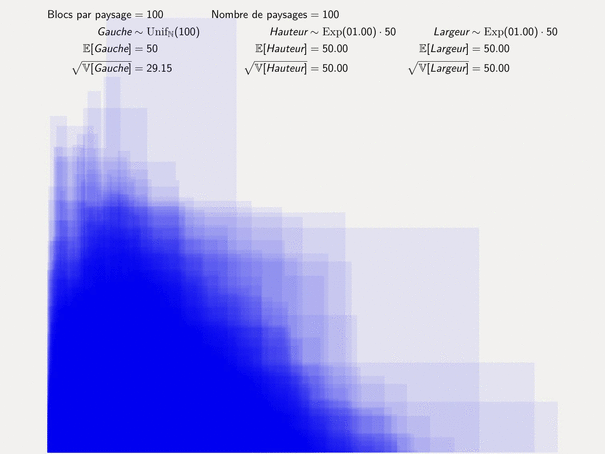
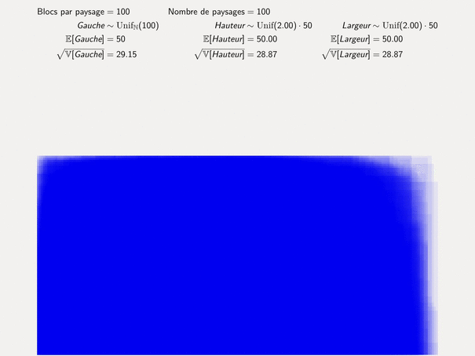
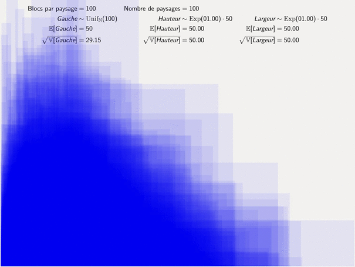
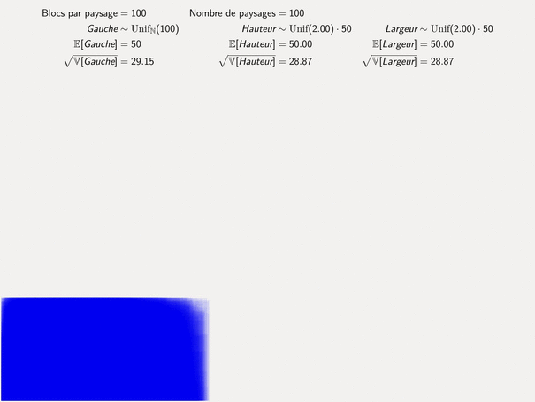

# Problème de la ligne d'horizon

Afin de convertir en PDF:

1. Convertir le paysage en LaTeX: `python3 exporter.py > paysage.tex`
2. Compiler: par ex.              `pdflatex paysage.tex`
3. Ouvrir `paysage.pdf`

_La compilation requiert le package TikZ pour LaTeX._

## Distribution des paysages

Le script `distribution.py` génère les animations ci-dessous. Chaque dessin est constitué de 100 pavages
aléatoires de 100 blocs superposés par semi-transparence. Cela répond partiellement à une question posée
en classe (A25) à propos de la distribution des paysages aléatoires obtenus par une loi exponentielle ou uniforme.
Cliquez sur les  animations pour les voir en pleine résolution.

### Largeur

Le script redimensionne chaque pavage à la largeur de l'image. Sans cette redimension, on obtient:

