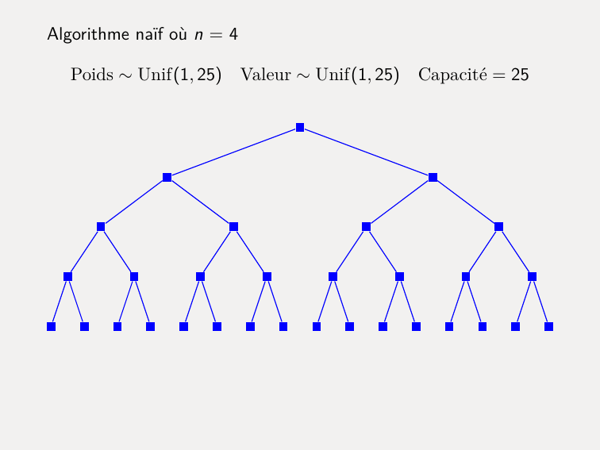
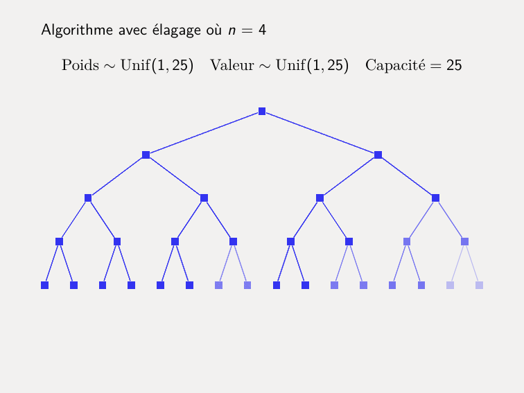
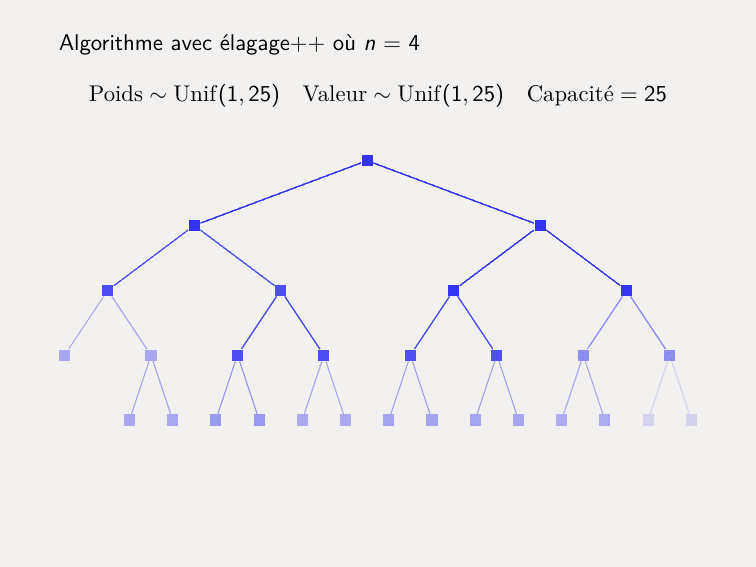

# Problème du sac à dos

Les implémentations des algorithmes se trouvent sous ```sac_a_dos.py```.

## Distribution des arbres de récursion

Le script `distribution.py` génère les animations ci-dessous. Chaque dessin est constitué de 100 arbres
de récursion des algorithmes exécutés sur 100 objets et sacs à dos aléatoires. Cliquez sur les 
animations pour les voir en pleine résolution.

[](img/naif.pdf)

[](img/elagage.pdf)

[](img/elagage++.pdf)
