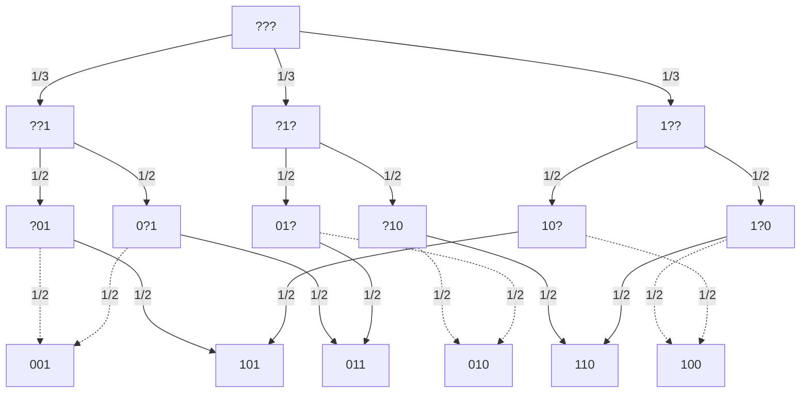

# Simuler un dé à 6 faces: autres tentatives

Rappelons que le chapitre 8 présente cet algorithme afin de simuler un
dé à 6 faces à l'aide d'une pièce (non biaisée):

```
Entrée: —
Sortie: nombre distribué uniformément parmi [1..6]

  faire:
    choisir un bit y₂ à pile ou face
    choisir un bit y₁ à pile ou face
    choisir un bit y₀ à pile ou face
  tant que y₂ = y₁ = y₀

  retourner 4·y₂ + 2·y₁ + y₀
```

En classe (A22, A25), des personnes ont suggéré des approches
alternatives pour gérer le cas où ``y₂ = y₁ = y₀``.

## Alternative 1

Dans la première approche alternative, on ne repige que ``y₂`` en cas
d'égalité:

```
Entrée: —
Sortie: nombre distribué uniformément parmi [1..6]

  choisir un bit y₂ à pile ou face
  choisir un bit y₁ à pile ou face
  choisir un bit y₀ à pile ou face

  tant que y₂ = y₁ = y₀:
    choisir un bit y₂ à pile ou face

  retourner 4·y₂ + 2·y₁ + y₀
```

Cette procédure est biaisée. Par exemple, la probabilité de générer 4,
c.-à-d. la chaîne ```100```, n'est pas de 1/6, mais bien de 1/4:

```
obtenir directement 100
    |
    | ou obtenir 000 puis remplacer le bit de poids fort
    |        |          en 1 ou 2 ou 3 ou ... itérations
    v        v
  (1/2)³ + (1/2)³ · ((1/2)¹ + (1/2)² + (1/2)³ + ...)

= (1/2)³ + (1/2)³ · (1/2 + 1/4 + 1/8 + ...)

= 1/8 + 1/8 · 1

= 1/4
```

En général, voici la distribution obtenue:

|*1*|*2*|*3*|*4*|*5*|*6*|
|---|---|---|---|---|---|
|1/8|1/8|1/4|1/4|1/8|1/8|
|0.125|0.125|0.250|0.250|0.125|0.125|0.125|0.125|

L'espérance du nombre de lancers de pièces est de 3.5, ce
qui est mieux que l'algorithme vu en classe dont l'espérance est 4:

```
           nombre de lancers initiaux
               |
               | probabilité d'obtenir 000 ou 111
               |     |
               |     |   espérance de la boucle
               |     |         |
               |     |         |
               v    vvv    vvvvvvvvvvvvv
𝔼[# lancers] = 3 + (1/4) · (1 / (1 / 2))
             = 3 + (1/4) · 2
             = 3.5
```

## Alternative 2

Dans la seconde approche alternative, en cas d'égalité, on repige ``y₂``, puis 
``y₁`` en cas d'échec, puis ``y₀`` en cas d'échec, et ainsi de suite de façon
cyclique.

```
Entrée: —
Sortie: nombre distribué uniformément parmi [1..6]

  choisir un bit y₂ à pile ou face
  choisir un bit y₁ à pile ou face
  choisir un bit y₀ à pile ou face

  k ← 2
  
  tant que y₂ = y₁ = y₀:
    choisir un bit yₖ à pile ou face
    k ← (k - 1) mod 2
    
  retourner 4·y₂ + 2·y₁ + y₀
```
Cette procédure est biaisée. Par exemple, la probabilité de générer 4,
c.-à-d. la chaîne ```100```, n'est pas de 1/6, mais bien de 11/56:

```
obtenir directement 100
    |
    | ou obtenir 000 puis remplacer le bit de poids fort
    |        |          en 1 ou 4 ou 7 ou ... itérations
    v        v
  (1/2)³ + (1/2)³ · ((1/2)¹ + (1/2)⁴ + (1/2)⁷ + ...)

= (1/2)³ + (1/2)³ · (1/2) · ((1/2)⁰ + (1/2)³ + (1/2)⁶ + ...)

= (1/2)³ + (1/2)³ · (1/2) · ((1/8)⁰ + (1/8)¹ + (1/8)² + ...)

= 1/8 + 1/8 · (1/2) · (8/7)

= 1/8 + 1/14

= 7/56 + 4/56

= 11 / 56
```

En général, voici la distribution obtenue:

|*1*|*2*|*3*|*4*|*5*|*6*|
|---|---|---|---|---|---|
|8/56|9/56|11/56|11/56|9/56|8/56|
|≈ 0.143|≈ 0.160|≈ 0.196|≈ 0.196|≈ 0.160|≈ 0.143|

L'espérance du nombre de lancers de pièces est de 3.5, ce
qui est mieux que l'algorithme vu en classe dont l'espérance est 4:

```
           nombre de lancers initiaux
               |
               | probabilité d'obtenir 000 ou 111
               |     |
               |     |   espérance de la boucle
               |     |         |
               |     |         |
               v    vvv    vvvvvvvvvvvvvvvvvvvvvvvvvvvvvvvvvvvvvvvvvvvv
𝔼[# lancers] = 3 + (1/4) · ((1/2)¹ · 1 + (1/2)² · 2 + (1/2)³ · 3 + ...)
             = 3 + (1/4) · 2
             = 3.5
```

## Alternative 3

Dans la troisième approche alternative, on choisit ``y₂`` en faisant
une distinction entre l'égalité ou l'inégalité des deux premiers bits:

```
Entrée: —
Sortie: nombre distribué uniformément parmi [1..6]

  choisir un bit y₂ à pile ou face
  choisir un bit y₁ à pile ou face

  si y₂ = y₁:
    y₀ ← 1 - y₁
  sinon:
    choisir un bit y₀ à pile ou face

  retourner 4·y₂ + 2·y₁ + y₀
```

Cette procédure est biaisée. Par exemple, la probabilité de générer 6,
c.-à-d. la chaîne ```110```, est de 1/4 plutôt que 1/6.

En général, voici la distribution obtenue:

|*1*|*2*|*3*|*4*|*5*|*6*|
|---|---|---|---|---|---|
|1/4|1/8|1/8|1/8|1/8|1/4|
|0.25|0.125|0.125|0.125|0.125|0.125|0.125|0.25|

L'espérance du nombre de lancers de pièces est de 2.5.

## Alternative 4

Dans la quatrième approche alternative, on choisit la position d'un bit
qui sera ```1```, puis la position d'un bit qui sera ```0```, puis un
bit aléatoire pour la dernière position:

```
Entrée: —
Sortie: nombre distribué uniformément parmi [1..6]

  choisir a ∈ {-1, 1} à pile ou face
  choisir b ∈ {0, 1}  à pile ou face
  choisir i ∈ {0, 1, 2} aléatoirement de façon uniforme    // Position du bit qui vaut 1
  j ← (i + a) mod 3                                        // Position du bit qui vaut b

  retourner 2ⁱ + b·2ʲ
```

Cette procédure fonctionne! Le graphe de probabilités ci-dessous montre que chaque nombre
peut être atteint par deux chemins, chacun de probabilité _1/3 · 1/2 · 1/2 = 1/12_. Ainsi,
chaque nombre est obtenu avec probabilité _2·(1/12) = 1/6_.



Il y a toutefois un enjeu avec cette approche: on suppose qu'on a accès à une pièce à trois faces.
Si ce n'est pas le cas, on doit émuler cette pièce, par ex. comme suit:

```
Entrée: —
Sortie: nombre distribué uniformément parmi [1..6]

  choisir a ∈ {-1, 1} à pile ou face
  choisir b ∈ {0, 1}  à pile ou face

  faire:
    choisir un bit i₁ à pile ou face
    choisir un bit i₀ à pile ou face
  tant que i₁ = i₀ = 1

  i ← 2·i₁ + i₀        // Position du bit qui vaut 1
  j ← (i + a) mod 3    // Position du bit qui vaut b

  retourner 2ⁱ + b·2ʲ
```

Dans cette implémentation, L'espérance du nombre de lancers de pièces est de
_2 + 2·(1 / (3 / 4)) = 2 + 8/3 = 14/3 = 4.66⋯_, ce qui est pire que l'algorithme vu en classe
dont l'espérance est 4.

## Modélisation avec PRISM

Pour les personnes curieuses, sachez que ces analyses peuvent être automatisées à l'aide de
l'outil [PRISM](http://www.prismmodelchecker.org/):

* Approche du chapitre 8: [``procedure1.prism``](./procedure1.prism)
* Approche alternative 1: [``procedure2.prism``](./procedure2.prism)
* Approche alternative 2: [``procedure3.prism``](./procedure3.prism)
* Propriétés à vérifier: [``propietes.pctl``](./proprietes.pctl)
